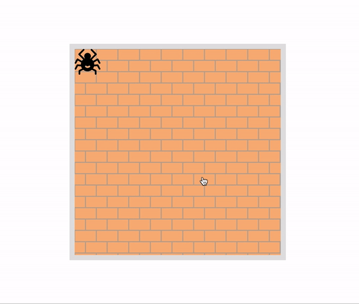

# Move the spider
- [DEMO LINK](https://MykhailoShchuka.github.io/js_task-move-spider-DOM/)

## Technologies used:
- JS
- DOM API
- HTML5
- SCSS
    
### Task

Move the spider to the cursor on click.

**Notes:**
- The spider center comes exactly under the pointer on click (without crossing the wall edge).
- The spider can not cross wall boundaries.
- When the page is scrolled, nothing breaks.
- The code works with spider and walls of any sizes.

### Gif of result

